# VideoEditorSwiftUI

Video editing application with great functionality of tools and the ability to export video in different formats.

## Features

- **Creating a video project and saving its progress**
- **Cropping video**
- **Changing the video duration**
- **Adding filters and effects to videos**
- **Adding text to a video**
- **Recording and editing audio**
- **Adding frames to videos**
- **Saving or share videos in different sizes**

## Includes

- SwiftUI
- iOS 16+
- MVVM
- Combine
- Core Data
- AVFoundation
- AVKit

## Screenshots 📷

### Projects and editor views

  <div align="center">
  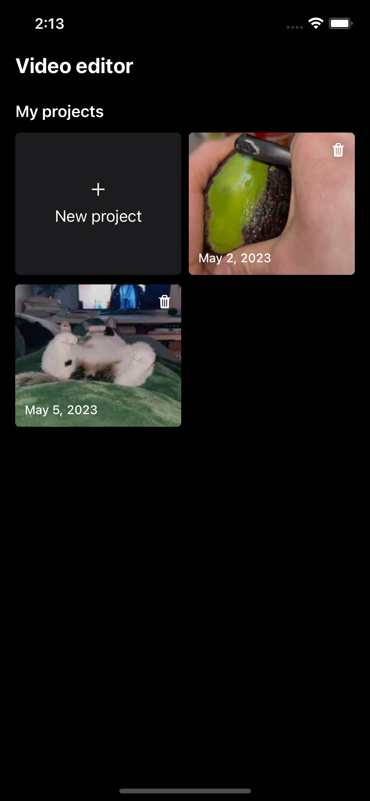
  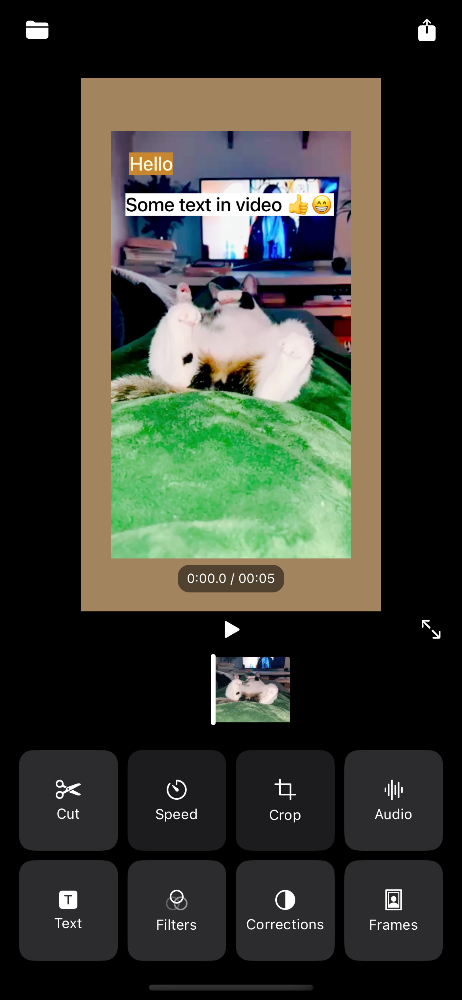
  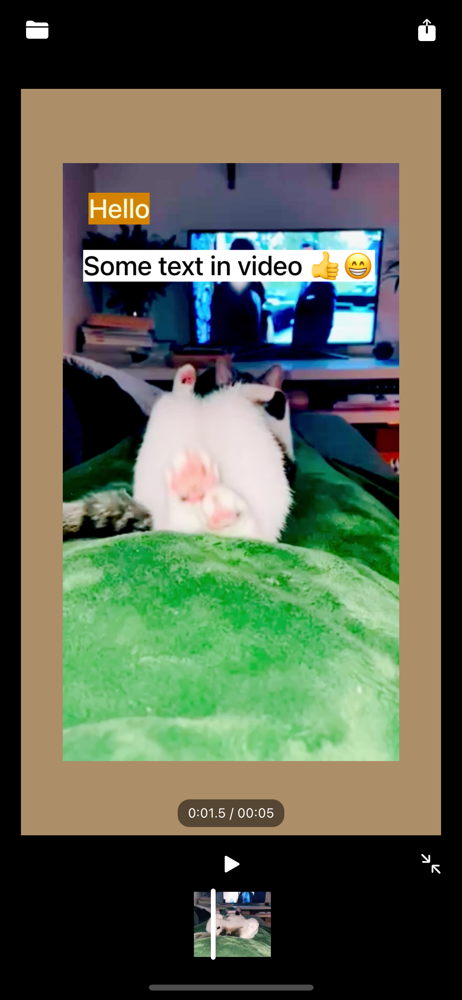
  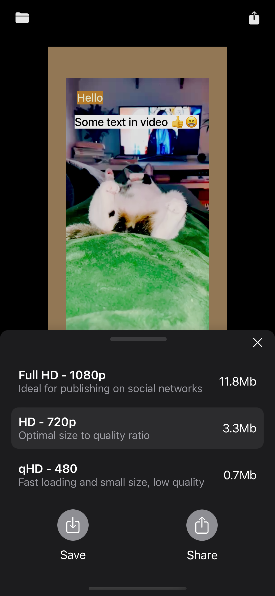
  </div>
  
### Editor tools

  <div align="center">
  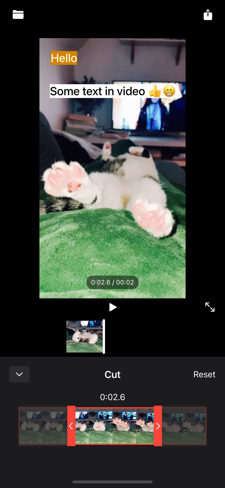
  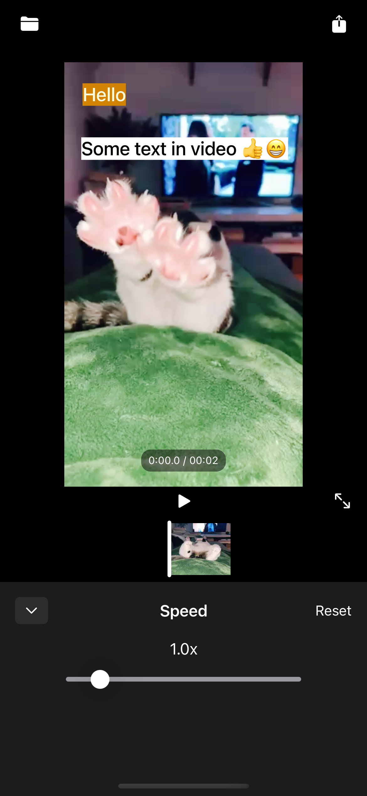
  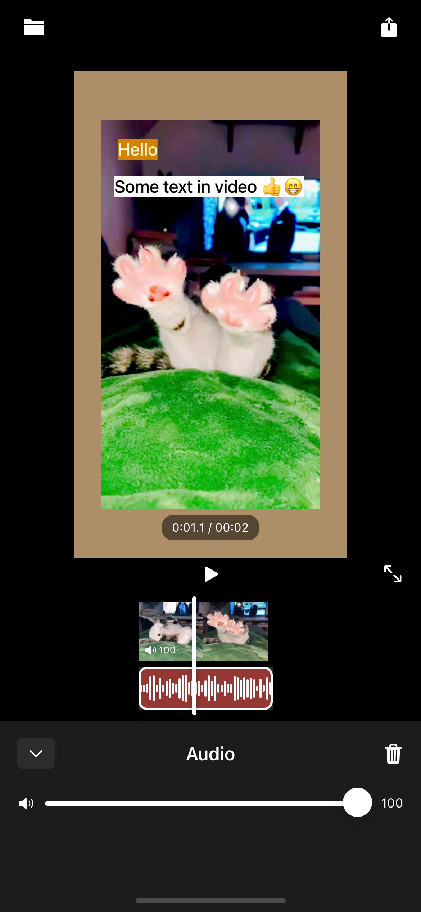
  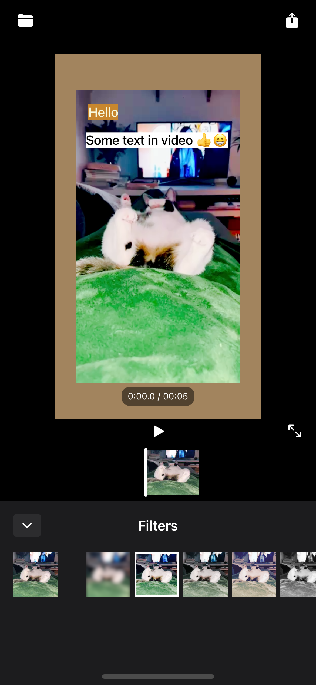
  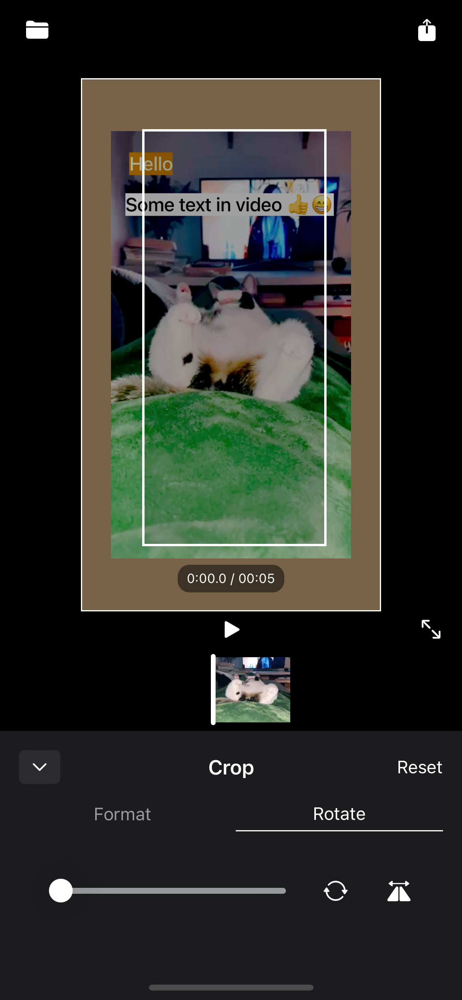
  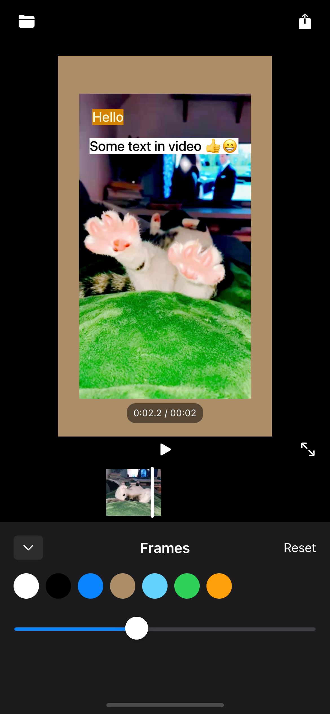
  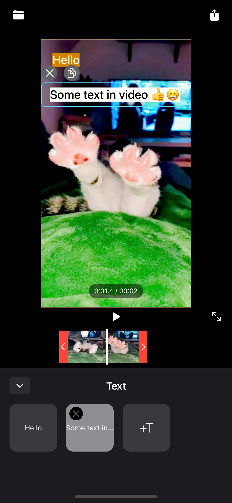
  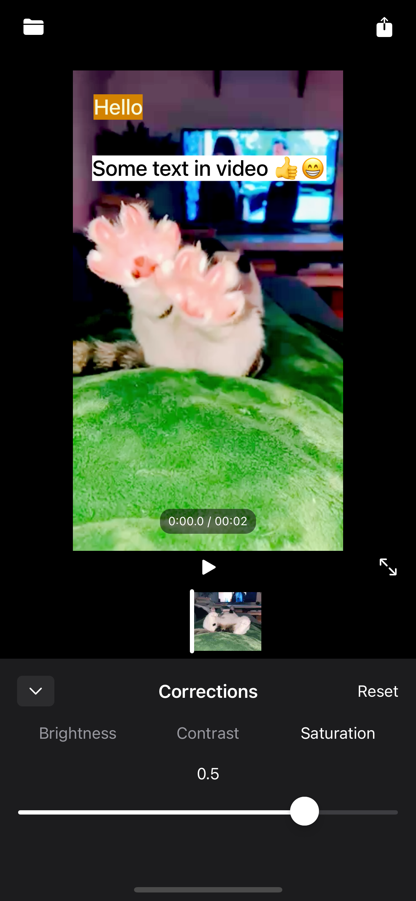
  </div>


### Text Features

This app always tries to ensure WYSIWYG (what you see is what you get) consistency between the editor, overlay, and exported video. This is important for accurate subtitle and caption editing.

### Implementation Summary
- **Model**: The `TextBox` model now includes shadow properties: `shadowColor`, `shadowRadius`, `shadowX`, `shadowY`, and `shadowOpacity`.
- **UI**: A new bottom sheet ("Shadow") was added to the text editor, allowing users to adjust shadow color, blur, offset, and opacity. Live preview is provided.
- **Editor/Overlay**: Both the text editor and overlay views use SwiftUI's `.shadow` modifier to render the shadow exactly as configured.
- **Export**: The export logic in `VideoEditor.swift` was updated to render the shadow using CoreGraphics, so the burned-in video matches the editor preview.

**Note:** When adding new text features, ensure changes are reflected in:
- The `TextBox` model
- The text editing UI (bottom sheets, controls)
- The overlay and editor rendering (SwiftUI views)
- The export logic (CoreGraphics/AVFoundation)

This guarantees that all text features are WYSIWYG and consistent across the app and exported videos.

## 🎬 Native TikTok-Style Subtitle Burning Implementation

This app implements professional-grade subtitle burning using **native iOS frameworks** (AVFoundation + Core Animation) instead of FFmpeg, following the same approach used by apps like CapCut, InShot, and VLLO.

### 🎯 Core Architecture

The app uses a **two-pass rendering pipeline** in `VideoEditor.swift`:

1. **First Pass**: `resizeAndLayerOperation()` - Handles video resizing, text overlay composition, and basic effects
2. **Second Pass**: `applyFiltersOperations()` - Applies color filters and final processing

### 🚀 Native Text Rendering (No FFmpeg)

The subtitle burning happens in the `createLayers()` method using **Core Animation layers**:

```swift
// Creates a layer tree with video + text overlays
let outputLayer = CALayer()
outputLayer.addSublayer(bgLayer)      // Background
outputLayer.addSublayer(videoLayer)   // Video content
// Add text layers for each subtitle
video.textBoxes.forEach { text in
    let textLayer = createTextLayer(with: text, ...)
    outputLayer.addSublayer(textLayer)
}
```

### ⏰ Frame-Accurate Timing

The app achieves frame-accurate timing through:

1. **CMTime-based synchronization**: Text layers are positioned using `CMTime` for precise timing
2. **CABasicAnimation for timing**: Each text layer gets animations with `beginTime` set to the subtitle's start time
3. **30fps rendering**: `videoComposition.frameDuration = CMTimeMake(value: 1, timescale: 30)`

### 🎨 Advanced Styling Support

The `TextBox` model supports rich styling that gets rendered natively:

- **Text styling**: Font size, color, stroke, shadow
- **Background styling**: Background color, padding, corner radius
- **Multi-line text**: Automatic line breaks with center alignment
- **Karaoke effects**: Word-by-word highlighting with multi-line support
- **Animations**: Fade in/out with precise timing

#### 📝 Regular Text Multi-Line Implementation

**Player Preview (SwiftUI)**:
- Uses `UIViewRepresentable` with `UILabel` for native text rendering
- `numberOfLines = 0` and `lineBreakMode = .byWordWrapping` for automatic wrapping
- Detects explicit line breaks (`\n`) and applies center alignment automatically

```swift
// AttributedTextOverlay handles regular text
func makeUIView(context: Context) -> UILabel {
    let label = UILabel()
    label.numberOfLines = 0
    label.lineBreakMode = .byWordWrapping
    
    let hasExplicitLineBreaks = attributedString.string.contains("\n")
    label.textAlignment = hasExplicitLineBreaks ? .center : .natural
    return label
}
```

**Export Pipeline (Core Graphics)**:
- Uses `NSAttributedString` with `NSMutableParagraphStyle` for text formatting
- Applies center alignment and word wrapping for multi-line text
- Uses `draw(in: CGRect)` instead of `draw(at: CGPoint)` to respect paragraph alignment

```swift
// Regular text export with center alignment
let paragraphStyle = NSMutableParagraphStyle()
paragraphStyle.alignment = .center
paragraphStyle.lineBreakMode = .byWordWrapping

let drawingRect = CGRect(x: padding, y: padding, width: width, height: height)
attributedString.draw(in: drawingRect) // Respects paragraph alignment
```

### 🎤 Karaoke Subtitle System

The app has sophisticated karaoke support with three modes:

1. **Letter-by-letter**: `KaraokeType.letter` - Highlights each letter progressively
2. **Word-by-word**: `KaraokeType.word` - Highlights each word
3. **Word background**: `KaraokeType.wordbg` - Adds background highlighting per word

#### 🎯 Multi-Line Karaoke Implementation

**Player Preview (SwiftUI)**:
- Uses custom `KaraokeTextLayout` to handle explicit line breaks (`\n`)
- Implements `KaraokeWrappingLayout` (iOS 16+ Layout protocol) for word positioning
- Center-aligns multi-line karaoke text automatically
- Consistent behavior: only explicit line breaks create new lines (no auto-wrapping)

```swift
// KaraokeTextLayout handles explicit line breaks
struct KaraokeTextLayout<Content: View>: View {
    private func organizeWordsIntoLines() -> [[WordWithTiming]] {
        let textLines = originalText.components(separatedBy: .newlines)
        // Maps words to their corresponding text lines
    }
    
    var body: some View {
        let lines = organizeWordsIntoLines()
        let hasMultipleLines = lines.count > 1
        
        VStack(alignment: hasMultipleLines ? .center : .leading, spacing: lineSpacing) {
            ForEach(0..<lines.count, id: \.self) { lineIndex in
                KaraokeLineLayout(words: lines[lineIndex], ...)
            }
        }
    }
}
```

**Export Pipeline (Core Graphics)**:
- Custom `calculateKaraokeWordPositions()` function for precise word placement
- Handles coordinate system differences (Y-axis inversion) between SwiftUI and Core Graphics
- Frame-accurate timing with `CMTime` synchronization
- Center-aligned multi-line rendering matching preview exactly

```swift
// Creates animated highlight layers for each word with precise positioning
let highlightLayer = CATextLayer()
highlightLayer.foregroundColor = UIColor(model.highlightColor).cgColor
let highlightAnim = CABasicAnimation(keyPath: "opacity")
highlightAnim.beginTime = word.start  // Frame-accurate timing
highlightAnim.duration = word.end - word.start
highlightLayer.frame = CGRect(x: wordPosition.x, y: wordPosition.y, ...)
```

#### 🔄 Text Parsing & Word Timing

**Consistent Word Splitting**: Both preview and export use `text.split { $0.isWhitespace }` to handle all whitespace characters (spaces, tabs, line breaks) uniformly.

**WordWithTiming Structure**:
```swift
struct WordWithTiming {
    let word: String
    let start: Double  // Start time in seconds
    let end: Double    // End time in seconds
}
```

### 🎬 Export Pipeline

The burning process uses **AVVideoCompositionCoreAnimationTool**:

```swift
// For device builds
videoComposition.animationTool = AVVideoCompositionCoreAnimationTool(
    postProcessingAsVideoLayer: videoLayer,
    in: outputLayer)

// For simulator (workaround)
videoComposition.animationTool = AVVideoCompositionCoreAnimationTool(
    additionalLayer: outputLayer,
    asTrackID: overlayTrackID)
```

### 🔄 WYSIWYG Preview

The preview matches the final output because:

1. **Same render tree**: The same `CALayer` hierarchy used in preview is burned during export
2. **Native rendering**: Uses Core Animation's hardware-accelerated rendering
3. **Real-time sync**: Text timing is synchronized with video playback using the same timing system

#### 🎯 Text Rendering Consistency

**Karaoke Text**: Perfect preview-export consistency achieved through:
- Identical word positioning algorithms in SwiftUI (`KaraokeTextLayout`) and Core Graphics
- Same text parsing logic (`text.split { $0.isWhitespace }`) in both contexts
- Coordinate system normalization (Y-axis inversion handling)
- Frame-accurate word timing preservation

**Regular Text**: WYSIWYG guaranteed by:
- Same `NSAttributedString` rendering in preview (`UILabel`) and export (Core Graphics)
- Identical paragraph styling and alignment detection
- Consistent multi-line behavior using `draw(in: CGRect)` for proper alignment
- Matching font, stroke, shadow, and background rendering

**Key Principle**: Both karaoke and regular text use **explicit line breaks only** - no auto-wrapping differences between preview and export.

### 🚀 Performance Benefits

- **Hardware acceleration**: Core Animation uses Metal for GPU rendering
- **No FFmpeg dependency**: Pure native iOS APIs
- **Battery efficient**: Optimized for mobile devices
- **Real-time preview**: Live editing with immediate visual feedback

### 📱 iOS Compliance

This approach is fully compliant with iOS App Store guidelines because:

- Uses only Apple's native frameworks (AVFoundation, Core Animation)
- No GPL-licensed dependencies like FFmpeg
- Leverages iOS's built-in video processing capabilities
- Hardware-accelerated rendering for smooth performance

This implementation demonstrates exactly how professional video editing apps achieve high-quality subtitle burning with frame-accurate timing and rich styling, all while maintaining iOS compliance and performance standards.

## 🎨 Adding New Karaoke Styles

This section documents how to add new karaoke subtitle styles to the app, using the "Word & Scale" implementation as a complete example.

### 📋 Overview

Adding a new karaoke style requires updates across 6 main areas:
1. **Model Layer** - Define the karaoke type and properties
2. **Preset Configuration** - Add the style to available presets
3. **Helper Functions** - Update karaoke generation logic
4. **Preview System** - Create SwiftUI preview component
5. **Export Pipeline** - Implement Core Animation rendering
6. **UI Integration** - Wire up preset selection logic

### 🔧 Step-by-Step Implementation

#### 1. Model Layer Updates (`TextBox.swift`)

**Add new karaoke type:**
```swift
enum KaraokeType: String, CaseIterable, Codable {
    case word = "Word"
    case wordbg = "WordBG"
    case wordAndScale = "WordAndScale"  // ✅ New type
}
```

**Add any new properties needed:**
```swift
struct TextBox: Identifiable {
    // ... existing properties
    
    // Custom karaoke properties
    var activeWordScale: CGFloat = 1.2 // ✅ New scaling property
}
```

**Update TextBox initializer:**
```swift
init(
    // ... existing parameters
    activeWordScale: CGFloat = 1.2,  // ✅ Add new parameter
    presetName: String? = nil
) {
    // ... existing logic
    self.activeWordScale = activeWordScale  // ✅ Set property
}
```

**Add preset case handling:**
```swift
switch preset.name {
case "Highlight by word":
    karaokePreset = .word
case "Background by word":
    karaokePreset = .wordbg
case "Word & Scale":                    // ✅ New preset case
    karaokePreset = .wordAndScale
default:
    karaokePreset = .word
}
```

**Create new KaraokePreset:**
```swift
static let wordAndScale = KaraokePreset(     // ✅ New preset
    karaokeType: .wordAndScale,
    highlightColor: .yellow,
    wordBGColor: .clear,
    presetName: "Word & Scale"
)
```

**Add to SubtitleStyle.allPresets:**
```swift
SubtitleStyle(
    name: "Word & Scale",               // ✅ New style preset
    fontSize: 32,
    bgColor: .clear,
    fontColor: .white,
    strokeColor: .black,
    strokeWidth: 2,
    backgroundPadding: 8,
    cornerRadius: 8,
    shadowColor: .black,
    shadowRadius: 6,
    shadowX: 0,
    shadowY: 2,
    shadowOpacity: 0.7,
    isKaraokePreset: true
),
```

#### 2. Helper Functions (`KaraokeSubsHelper.swift`)

**Update karaoke generation switch:**
```swift
switch karaokeType {
case .word:
    preset = KaraokePreset.word
case .wordbg:
    preset = KaraokePreset.wordbg
case .wordAndScale:                     // ✅ Handle new type
    preset = KaraokePreset.wordAndScale
}
```

#### 3. UI Integration (Preset Selection)

**Update `ToolsSectionView.swift`:**
```swift
private func getKaraokeType(for style: SubtitleStyle) -> KaraokeType {
    switch style.name {
    case "Highlight by word": return .word
    case "Background by word": return .wordbg
    case "Word & Scale": return .wordAndScale  // ✅ Map preset name
    default: return .word
    }
}
```

**Update `PresetsListView.swift`:**
```swift
private func getKaraokeType(for presetName: String) -> KaraokeType {
    switch presetName {
    case "Highlight by word": return .word
    case "Background by word": return .wordbg
    case "Word & Scale": return .wordAndScale  // ✅ Map preset name
    default: return .word
    }
}
```

#### 4. Preview System (`TextOnPlayerView.swift`)

**Add new karaoke overlay condition:**
```swift
else if let wordTimings = textBox.wordTimings, 
        let karaokeType = textBox.karaokeType,
        let highlightColor = textBox.highlightColor,
        karaokeType == .wordAndScale {          // ✅ New condition
    KaraokeTextWordAndScaleOverlay(
        text: textBox.text,
        words: wordTimings,
        fontSize: textBox.fontSize,
        fontColor: textBox.fontColor,
        highlightColor: highlightColor,
        strokeColor: textBox.strokeColor,
        strokeWidth: textBox.strokeWidth,
        shadowColor: textBox.shadowColor,
        shadowRadius: textBox.shadowRadius,
        shadowX: textBox.shadowX,
        shadowY: textBox.shadowY,
        shadowOpacity: textBox.shadowOpacity,
        activeWordScale: textBox.activeWordScale,  // ✅ Pass new property
        currentTime: currentTime
    )
}
```

**Create new SwiftUI preview component:**
```swift
struct KaraokeTextWordAndScaleOverlay: View {
    // Properties for styling and animation
    let text: String
    let words: [WordWithTiming]
    let fontSize: CGFloat
    let fontColor: Color
    let highlightColor: Color
    // ... other styling properties
    let activeWordScale: CGFloat        // ✅ New scaling property
    let currentTime: Double

    var body: some View {
        KaraokeTextLayout(
            originalText: text,
            words: words,
            spacing: 4,
            lineSpacing: 2
        ) { word in
            let isActive = currentTime >= word.start && currentTime < word.end
            let progress: CGFloat = isActive ? 1 : (currentTime >= word.end ? 1 : 0)
            
            // ✅ Calculate dynamic scale
            let targetScale: CGFloat = isActive ? activeWordScale : 1.0
            
            ZStack(alignment: .leading) {
                // Base text layer
                StrokeText(/* ... */)
                    .scaleEffect(targetScale)                           // ✅ Apply scaling
                    .animation(.easeInOut(duration: 0.15), value: targetScale)
                
                // Highlight text layer
                StrokeText(/* ... with highlight color */)
                    .scaleEffect(targetScale)                           // ✅ Apply scaling
                    .opacity(progress)
                    .animation(.easeInOut(duration: 0.15), value: targetScale)
                    .animation(.linear(duration: 0.05), value: progress)
            }
        }
    }
}
```

#### 5. Export Pipeline (`VideoEditor.swift`)

**Add scaling logic in `createKaraokeTextLayer`:**

```swift
// Get scaling factor from model
let activeWordScale = model.activeWordScale        // ✅ Extract scale factor

// For each word, add scaling animations to base layer
if karaokeType == .wordAndScale {                  // ✅ New karaoke type check
    // Scale up animation when word becomes active
    let scaleUpAnimation = CABasicAnimation(keyPath: "transform.scale")
    scaleUpAnimation.fromValue = 1.0
    scaleUpAnimation.toValue = activeWordScale
    scaleUpAnimation.beginTime = word.start
    scaleUpAnimation.duration = 0.15
    scaleUpAnimation.fillMode = .forwards
    scaleUpAnimation.isRemovedOnCompletion = false
    baseLayer.add(scaleUpAnimation, forKey: "wordAndScaleUp")
    
    // Scale down animation when word becomes inactive
    let scaleDownAnimation = CABasicAnimation(keyPath: "transform.scale")
    scaleDownAnimation.fromValue = activeWordScale
    scaleDownAnimation.toValue = 1.0
    scaleDownAnimation.beginTime = word.end
    scaleDownAnimation.duration = 0.15
    scaleDownAnimation.fillMode = .forwards
    scaleDownAnimation.isRemovedOnCompletion = false
    baseLayer.add(scaleDownAnimation, forKey: "wordAndScaleDown")
}

// Apply same scaling to highlight layer
if karaokeType == .wordAndScale {                  // ✅ Scale highlight layer too
    // ... same scaling animations for highlightLayer
}
```

**Update `TextLayoutHelper.swift` for new properties:**
```swift
private static func createTextBoxFromProperties(/* ... */) -> TextBox {
    return TextBox(
        // ... existing properties
        activeWordScale: properties["activeWordScale"] as? CGFloat ?? 1.2,  // ✅ Preserve new property
        presetName: properties["presetName"] as? String
    )
}
```

### 🎯 Key Implementation Principles

1. **WYSIWYG Consistency**: The SwiftUI preview must match the exported video exactly
2. **Frame-Accurate Timing**: Use `CMTime` and `CABasicAnimation.beginTime` for precise synchronization
3. **Property Preservation**: All custom properties must be handled in `TextLayoutHelper.createTextBoxFromProperties`
4. **Complete Integration**: Update all switch statements that handle karaoke types
5. **Animation Coordination**: Both base and highlight layers need the same animations for visual consistency

### 🔍 Testing Checklist

When adding a new karaoke style, verify:

- [ ] Preset appears in presets list
- [ ] Preset selection triggers karaoke generation
- [ ] Preview shows the effect in real-time
- [ ] Preview animations match intended behavior
- [ ] Export produces the same visual effect as preview
- [ ] Multi-line text works correctly
- [ ] All text styling options (stroke, shadow, etc.) work
- [ ] Animation timing is frame-accurate
- [ ] Memory usage is reasonable during export

### 💡 Example: Word & Scale Implementation

The "Word & Scale" karaoke style demonstrates a complete implementation that:
- Combines word highlighting (like existing karaoke) with dynamic scaling
- Scales active words to 120% size by default (configurable via `activeWordScale`)
- Uses smooth 0.15-second scale transitions
- Maintains perfect preview-export consistency
- Supports all existing text styling features

This implementation serves as a template for creating other advanced karaoke effects like rotation, color transitions, or particle effects.

  
  
